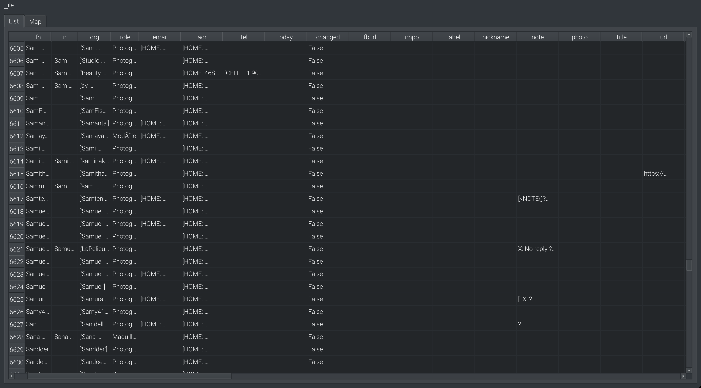

# Open Contact Book

Open Contact Book is a buiness-oriented, cross-platform, Python Qt
application allowing to manage databases of contacts through CardDAV.

[CardDAV](https://en.wikipedia.org/wiki/CardDAV) is an open
protocol for client/server access and sharing of contacts. It
is based on `.vcf` files that are essentially text files.

It is supported by a large amount of server applications, to host
your contact books on the internet and share them between devices,
like Google Agenda, OwnCloud/NextCloud, or even CPanel.

It is also supported by a large amount of client applications,
DAVx⁵ on Android, Blackberry OS 10, Apple iOS and Contacts,
Thunderbird (through CardBook extension, and more recently natively)
on Windows, Linux and Mac, Evolution on Linux, etc.

However, most CardDAV application are really limited when it comes
to managing a large number of contacts, or just to merge duplicates.
They also have nothing to backup changes and prevent file corruption,
nor to manage geolocation. They became really slow as the number
of entries increases.

## Current features

### Spreadsheet view



The spreadsheet view is a read/write table of all the `.vcf` contacts
files found in the address book repository. It allows fast access
for bulk-editing and exposes some of the technicality of the
Vcard format for the sake of fast manual access.

TODO: the changes made to the spreadsheet are not actually saved
for now. This is just a view.

### Map view


The map view uses [Nominatim](https://nominatim.org) and
[OpenStreetMap](https://openstreetmap.org) databases
to geolocate your contacts on a map, in a completely de-googled,
privacy-compliant, way.

Where are your contacts located ? Turn your address book into
knowledge to plan for efficient touring or clients meetings.

An advanced text parsing tries to find hints of the accurate
location, using a spellcheck on the country names and various
combinations of addresses parts until it finds a match. The geolocation data is cached on your disk and will run faster
the next time.

### Contact view

TODO: display a sum-up of the contact info with preview/display modes.

### Filtering and sorting

TODO: fetch contacts whose tags and data match some rules.

### Merging contacts and fields

TODO: merge duplicate contacts with rules, merge columns and refactor
your custom Vcard field.

### Reliability

TODO: include git commit and versionning built-in, to track history
and revert any change in case of issues or corrupted data.

## Developer friendly

### Lib-ified

All the data processing can run headless, without a GUI.
The GUI Qt code and the data processing are actually fully separated.

### Use data-mining technologies

The database of contacts is actually a usual `pandas.DataFrame`.
This allows fast data handling because Python only acts as a binding
to lower-level data routines, while retaining all the power and
flexbility of Python objects. It also enables to use the usual
data-mining and maching-learning libraries.

### Python terminal

TODO: access the internal `pandas.DataFrame` directly from a terminal
widget, to apply advanced regex parsing etc.

## Support

For now, only local repositories of `.vcf` files are supported.
It is tested with Vcard 3.0 created with Thunderbird CardBook
plugin. It is tested against a database of 9000 contacts.


## Install

### Python

Install the [Python interpreter](https://www.python.org/downloads/)
and [PIP](https://pip.pypa.io/en/stable/installation/)

### Get the code

Dowload it here.

### Dependencies

Run the script `install.sh` at the root of the code directory:

```bash
$ sh install.sh
```

### Software

The code can't be installed system-wise yet, as this work is still
in a very early stage.

Start it from the terminal:

```bash
$ python main.py
```
